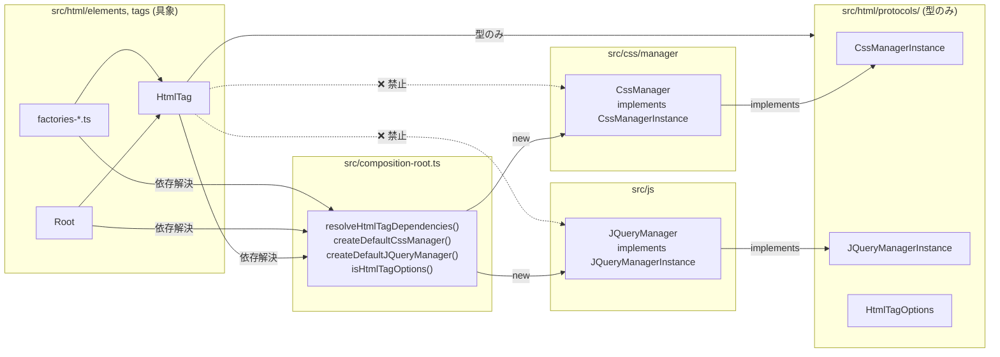
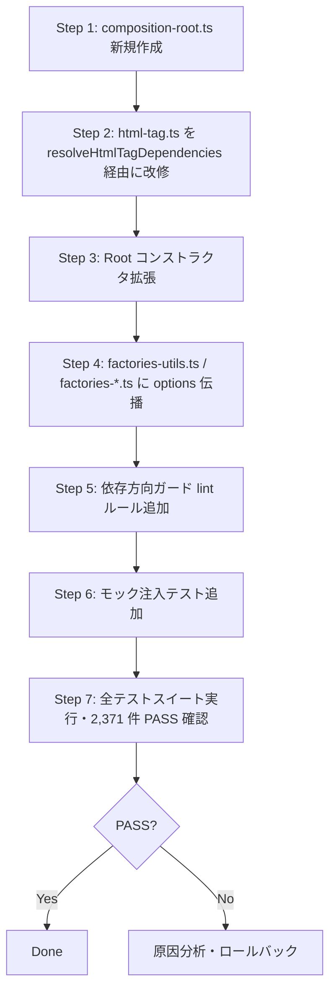

# Design Document — cfa-dependency-inversion

## Overview

**Purpose**: 本リファクタリングは、`src/html/elements/html-tag.ts` が `CssManager` / `JQueryManager` の具象クラスを直接 import・`new` している逆方向依存を解消し、Composition Root パターンでデフォルトインスタンス生成を一元化する。

**Users**: DraftOle ライブラリのメンテナ・コントリビュータが対象。外部利用者には破壊的変更を露出させない。

**Impact**: 依存方向を `html/ → css/, js/（具象）` から `html/ → html/protocols/（型のみ）` に正し、テスト時のモック注入経路と将来の実装差し替えポイントを確立する。

### Goals
- `html-tag.ts` および `html/protocols/` 配下から `src/css/`・`src/js/` 内の具象実装への import を排除する。
- `src/composition-root.ts` を新設し、デフォルトの `CssManager` / `JQueryManager` 生成をここに集約する。
- `Root` コンストラクタおよび `html/tags/factories*.ts` 群に `HtmlTagOptions` を伝播させ、利用者が指定した依存を生成ツリー全体で共有できるようにする。
- モック注入による単体テストを追加し、依存反転が機能していることを検証する。

### Non-Goals
- 外部公開 API（`src/index.ts` からの export）シグネチャ・挙動の変更。
- `CssManager` / `JQueryManager` 自体の内部実装変更。
- ファイル分割（CFA-B）・型定義分散（CFA-C）は別スペックで扱う。
- 生成戦略の差し替え（`CssManagerFactory` 等の Factory 抽象化）は将来スコープ。

## Boundary Commitments

**このスペックが所有する変更**:
- `src/composition-root.ts` の新規作成
- `src/html/elements/html-tag.ts` のコンストラクタ実装の差し替え（具象 import 除去 + Composition Root 利用）
- `src/html/elements/root.ts` の `Root` コンストラクタへ `HtmlTagOptions` を受け取る拡張
- `src/html/tags/factories-utils.ts`（および必要に応じて `factories-*.ts`）の `makePairTag` / `makeSelfClosingTag` 等への `HtmlTagOptions` 伝播
- プロトコル依存ガード（ESLint `no-restricted-imports` ルール or 代替テスト）の追加
- モック注入ユニットテストの追加

**このスペックが所有しない範囲**:
- `src/css/manager/css-manager.ts`・`src/js/jquery-manager.ts` 内部ロジック（ただしプロトコル整合性確認は対象内）
- `src/html/protocols/` 内プロトコル定義の挙動変更（既にクリーンのため、必要なら微修正のみ）
- `src/index.ts` 公開 API の変更

**許可される依存**:
- `src/composition-root.ts` → `src/css/manager/css-manager.ts`, `src/js/jquery-manager.ts`（具象を参照する唯一の場所）
- `src/html/elements/*.ts` → `src/html/protocols/*.ts`（型のみ）
- `src/html/elements/*.ts` → `src/composition-root.ts`（依存解決関数）

**ダウンストリーム再検証のトリガ**:
- プロトコル（`CssManagerInstance` / `JQueryManagerInstance`）の追加・破壊的変更
- Composition Root 公開関数シグネチャの変更
- `HtmlTagOptions` 型の追加フィールド

## Architecture

### Existing Architecture Analysis
- プロトコル層（`src/html/protocols/`）は既に型のみを公開し、`src/css/` や `src/js/` の具象への import を持たない。依存方向逆転は型レベルでは完了している。
- `CssManager` は `CssManagerInstance` を、`JQueryManager` は `JQueryManagerInstance` を `implements` 済み。
- 唯一の逆方向依存は `html-tag.ts` L116–117 の fallback `new CssManager()` / `new JQueryManager()` と、それに伴う具象 import。
- `Root`（`HtmlTag` 派生）と factory 関数群は `HtmlTagOptions` を受け取らないため、DI 伝播路が途切れている。

### Architecture Pattern & Boundary Map

選択パターン: **Composition Root + Constructor Injection**（Mark Seemann）。生成の知識を単一点（`src/composition-root.ts`）に集中させ、他のコードは抽象型（プロトコル）のみを参照する。



**Architecture Integration**:
- **Selected pattern**: Composition Root + Constructor Injection — 既存 `HtmlTagOptions` DI 基盤を活かし最小変更で実現。
- **Domain/feature boundaries**: `composition-root.ts` が唯一具象を知る。`html/` は抽象型のみに依存。
- **Existing patterns preserved**: `HtmlTagOptions` による optional DI、`implements` による名目型宣言。
- **New components rationale**: `composition-root.ts` は「具象を知る責務」を集約するための新規モジュール。単一の責務を持つ。
- **Steering compliance**: Swift 版からの 1:1 移植原則に準拠（挙動変更なし）、TypeScript `any` 回避、プロトコル ↔ 実装の分離を強化。

### Technology Stack

| Layer | Choice / Version | Role in Feature | Notes |
|-------|------------------|-----------------|-------|
| Language | TypeScript（プロジェクト既定） | 型安全な DI・プロトコル実装 | `any` 禁止、正確な型を維持 |
| Test Runner | 既存のテストランナー（プロジェクト既定） | モック注入テスト・全 2,371 件の回帰実行 | 既存構成を踏襲 |
| Lint | ESLint（導入済みの場合） | `no-restricted-imports` で依存方向ガード | 未導入時は単体テストで代替 |
| Build | 既存の TS ビルドパイプライン | 影響なし | `tsc --noEmit` で型チェック |

## System Flows

### 依存解決フロー（利用者 → タグ生成）

```mermaid
sequenceDiagram
  participant U as 利用者コード
  participant F as factory (e.g. html())
  participant FU as makePairTag / makeSelfClosingTag
  participant HT as HtmlTag constructor
  participant CR as composition-root
  participant CM as CssManager (具象)
  participant JM as JQueryManager (具象)

  U->>F: html(attrs, children, options?)
  F->>FU: makePairTag(tagType, args, options?)
  FU->>HT: new PairType(tagType, options?)
  HT->>CR: resolveHtmlTagDependencies(options?)
  alt options.css/jqm が指定
    CR-->>HT: { css: options.css, jqm: options.jqm }
  else options 未指定 / 部分指定
    CR->>CM: new CssManager() (必要時のみ)
    CR->>JM: new JQueryManager() (必要時のみ)
    CR-->>HT: { css, jqm } (解決済み)
  end
  HT->>HT: this._css = deps.css; this._jqm = deps.jqm
```

**フロー決定事項**:
- `resolveHtmlTagDependencies` は純関数。副作用なし、毎回必要最小限のデフォルトを生成する（現行 `new CssManager()` 都度生成と同じセマンティクス）。
- options が部分指定（css のみ、jqm のみ）でも正しく補完される。
- factory 関数は options を受け取らない既存呼び出しでは末尾引数がなく、`undefined` が伝播するため現行挙動と等価。

## Requirements Traceability

| Requirement | Summary | Components | Interfaces | Flows |
|-------------|---------|------------|------------|-------|
| 1.1 | `html-tag.ts` から具象 import を除去 | `HtmlTag`, `composition-root` | `resolveHtmlTagDependencies` | 依存解決フロー |
| 1.2 | コンストラクタで注入型のみ使用 | `HtmlTag` | `CssManagerInstance`, `JQueryManagerInstance` | 依存解決フロー |
| 1.3 | options 未指定時も具象生成せず CR 経由 | `HtmlTag`, `composition-root` | `resolveHtmlTagDependencies` | 依存解決フロー |
| 1.4 | `html/` から `css/`, `js/` 具象への import なし | 全 `html/` 配下 | —（依存方向ガード） | — |
| 2.1 | `html/protocols/` から具象 import なし | `src/html/protocols/*` | — | — |
| 2.2 | `CssManager implements CssManagerInstance` | `CssManager` | `CssManagerInstance` | — |
| 2.3 | `JQueryManager implements JQueryManagerInstance` | `JQueryManager` | `JQueryManagerInstance` | — |
| 2.4 | 公開メソッド・プロパティの整合 | `CssManager`, `JQueryManager` | 両プロトコル | — |
| 3.1 | `src/composition-root.ts` 新設・生成関数公開 | `composition-root` | `createDefaultCssManager`, `createDefaultJQueryManager`, `resolveHtmlTagDependencies` | — |
| 3.2 | 外部コードは CR 経由でインスタンス取得 | `HtmlTag`, `Root`, factory 群 | `resolveHtmlTagDependencies` | 依存解決フロー |
| 3.3 | 直接 `new` 呼び出しを含まない | `html-tag.ts`, `root.ts`, `factories*.ts` | — | — |
| 3.4 | 複数回呼び出し時も契約上同等 | `composition-root` | 生成関数群 | — |
| 4.1 | `root()` が options を配下へ伝播 | `Root`, `HtmlTag` | `HtmlTagOptions` | 依存解決フロー |
| 4.2 | factory 関数が options を受け渡す | `makePairTag`, `makeSelfClosingTag` | `HtmlTagOptions` | 依存解決フロー |
| 4.3 | options 未指定で CR デフォルト使用 | `HtmlTag`, `composition-root` | `resolveHtmlTagDependencies` | 依存解決フロー |
| 4.4 | 同一参照が生成ツリー内で共有 | `HtmlTag`, `Root`, factory 群 | `HtmlTagOptions` | 依存解決フロー |
| 5.1 | モック注入時に具象が生成されない | `HtmlTag`, `composition-root` | `HtmlTagOptions` | 依存解決フロー |
| 5.2 | モック経由で副作用なく検証可能 | `HtmlTag` | `CssManagerInstance`, `JQueryManagerInstance` | — |
| 5.3 | モック注入検証テストを 1 件以上追加 | テストスイート | — | — |
| 6.1 | 公開 API シグネチャ・挙動維持 | `src/index.ts` 全 export | — | — |
| 6.2 | 既存 2,371 テスト全 PASS | 全テスト | — | — |
| 6.3 | options 未指定時の出力が従来と一致 | `HtmlTag`, `composition-root` | — | — |
| 6.4 | 公開型に破壊的変更なし | 型定義 | `HtmlTagOptions` ほか | — |

## Components and Interfaces

| Component | Domain/Layer | Intent | Req Coverage | Key Dependencies (P0/P1) | Contracts |
|-----------|--------------|--------|--------------|--------------------------|-----------|
| `composition-root.ts` | Infrastructure（新規） | 具象依存の生成・解決を一元化 | 1.3, 3.1–3.4, 4.3 | `CssManager` (P0), `JQueryManager` (P0) | Service |
| `HtmlTag`（改修） | Domain / html | プロトコル型のみで依存を保持 | 1.1–1.4, 2.x, 3.2, 3.3, 4.3, 5.x, 6.3 | `composition-root` (P0), プロトコル (P0) | Service |
| `Root`（改修） | Domain / html | ルート要素で options を受け付け伝播 | 4.1, 4.4 | `HtmlTag` (P0) | Service |
| `factories-utils.ts` / `factories-*.ts`（改修） | Domain / html | factory 関数で options を伝播 | 4.2, 4.4, 6.1 | `HtmlTag`, `composition-root` (P1) | Service |
| 依存方向ガード（lint/test） | Quality Gate | 退行検出 | 1.4, 2.1 | ESLint 設定 or テストランナー | — |

### Infrastructure

#### `composition-root.ts`（新規）

| Field | Detail |
|-------|--------|
| Intent | 具象 `CssManager` / `JQueryManager` の生成を唯一担うモジュール |
| Requirements | 1.3, 3.1, 3.2, 3.3, 3.4, 4.3 |

**Responsibilities & Constraints**
- 具象クラスを知る唯一の場所。`html/` 配下からは抽象型のみを介してアクセスされる。
- 純関数として毎呼び出しで必要な場合にのみ新規インスタンスを生成（現行の都度生成セマンティクスを保存）。
- モジュール内で状態（シングルトン）を保持しない。

**Dependencies**
- Inbound: `HtmlTag`（コンストラクタ）、`Root`、factory 群 — 依存解決（P0）
- Outbound: `src/css/manager/css-manager.ts` の `CssManager`（P0）、`src/js/jquery-manager.ts` の `JQueryManager`（P0）
- External: なし

**Contracts**: Service [x]

##### Service Interface

```typescript
// src/composition-root.ts
import { CssManager } from './css/manager/css-manager';
import { JQueryManager } from './js/jquery-manager';
import type {
  CssManagerInstance,
  JQueryManagerInstance,
  HtmlTagOptions,
} from './html/protocols';

export function createDefaultCssManager(): CssManagerInstance {
  return new CssManager();
}

export function createDefaultJQueryManager(): JQueryManagerInstance {
  return new JQueryManager();
}

export interface ResolvedHtmlTagDependencies {
  readonly css: CssManagerInstance;
  readonly jqm: JQueryManagerInstance;
}

export function resolveHtmlTagDependencies(
  options?: HtmlTagOptions,
): ResolvedHtmlTagDependencies {
  return {
    css: options?.css ?? createDefaultCssManager(),
    jqm: options?.jqm ?? createDefaultJQueryManager(),
  };
}

export function isHtmlTagOptions(value: unknown): value is HtmlTagOptions {
  if (value === null || typeof value !== 'object') return false;
  return 'css' in value || 'jqm' in value;
}
```

- **Preconditions**: `options` は未指定・部分指定・完全指定のいずれも許容。
- **Postconditions**: 戻り値の `css` / `jqm` は必ず非 null。`options` 完全指定時は渡された参照と同一。
- **Invariants**: 内部状態を持たず、副作用はインスタンス生成のみ。

**Implementation Notes**
- Integration: `html-tag.ts` の fallback・`Root`・factory 群の options 受け渡し処理の終端として呼ばれる。
- Validation: `isHtmlTagOptions` は factory 可変長引数での判別に使用。`'css' in value || 'jqm' in value` で構造的チェック（空 options `{}` は attribute/child と区別不能のため HtmlTagOptions とは扱わない）。
- Risks: `isHtmlTagOptions` の誤判定 → Risk 1（後述）で対処。

### Domain / html

#### `HtmlTag`（改修）

| Field | Detail |
|-------|--------|
| Intent | プロトコル型のみで CSS/jQuery 依存を保持するタグ基底クラス |
| Requirements | 1.1, 1.2, 1.3, 1.4, 2.1, 2.2, 2.3, 2.4, 3.2, 3.3, 4.3, 5.1, 5.2, 6.3 |

**Responsibilities & Constraints**
- `CssManager` / `JQueryManager` 具象 import を持たない。
- コンストラクタは `resolveHtmlTagDependencies(options)` を呼び、`deps.css` / `deps.jqm` を `_css` / `_jqm` に保持する。

**Dependencies**
- Inbound: `Root`、`PairType`、`SelfClosingType`、`TextType`（派生クラス）
- Outbound: `src/html/protocols/*`（型のみ）、`src/composition-root.ts`（依存解決）
- External: なし

**Contracts**: Service [x]

##### Service Interface（差分のみ）

```typescript
// src/html/elements/html-tag.ts（改修）
import type { CssManagerInstance, JQueryManagerInstance } from '../protocols';
import { resolveHtmlTagDependencies } from '../../composition-root';

export interface HtmlTagOptions {
  css?: CssManagerInstance;
  jqm?: JQueryManagerInstance;
}

export abstract class HtmlTag implements HTMLTagProtocol, CssManagerType, JQueryManagerProtocol {
  private _css: CssManagerInstance;
  private _jqm: JQueryManagerInstance;

  constructor(tagType: TagType, options?: HtmlTagOptions) {
    this.tagType = tagType;
    const deps = resolveHtmlTagDependencies(options);
    this._css = deps.css;
    this._jqm = deps.jqm;
  }
  // 以降は既存のまま
}
```

- **Preconditions**: `options` は optional、部分指定許容。
- **Postconditions**: `this._css` / `this._jqm` は常に非 null で、`CssManagerInstance` / `JQueryManagerInstance` 契約を満たす。
- **Invariants**: コンストラクタ完了後、`options` 完全指定時は利用者参照と同一。

**Implementation Notes**
- Integration: `HtmlTagOptions` の型定義は現状の `src/html/elements/html-tag.ts` からエクスポートされ続ける（公開互換のため）。可能ならプロトコル層（`src/html/protocols/`）に移設して `composition-root.ts` からも型として import する（循環回避）。移設時は `html-tag.ts` から `export { HtmlTagOptions } from '../protocols'` のように再 export し公開 API を維持。
- Validation: コンストラクタ内で `resolveHtmlTagDependencies` により一括解決。
- Risks: 既存テストが `_css` / `_jqm` の初期値を inspect している場合、挙動互換性確認が必要。

#### `Root`（改修）

| Field | Detail |
|-------|--------|
| Intent | ルート要素から `HtmlTagOptions` を受け取り HtmlTag へ伝播 |
| Requirements | 4.1, 4.4, 6.1 |

**Responsibilities & Constraints**
- 既存の `constructor()` を `constructor(options?: HtmlTagOptions)` に拡張し、`super('root', options)` を呼ぶ。
- 既存の引数なし呼び出しは互換維持（optional 引数）。

**Dependencies**
- Inbound: `src/index.ts` 経由の利用者コード
- Outbound: `HtmlTag`

**Contracts**: Service [x]

#### `factories-utils.ts` および `factories-*.ts`（改修）

| Field | Detail |
|-------|--------|
| Intent | factory 呼び出しに optional `HtmlTagOptions` を追加し、内部生成に伝播 |
| Requirements | 4.2, 4.4, 6.1 |

**Responsibilities & Constraints**
- `makePairTag` / `makeSelfClosingTag` のシグネチャを拡張：末尾に optional `options?: HtmlTagOptions`。
- 内部で `new PairType(tagType, options)` / `new SelfClosingType(tagType, options)` を呼ぶ。
- 外部 factory（`html`, `div`, `p`, ...）は末尾に `HtmlTagOptions` を optional 引数として追加。引数判別は `isHtmlTagOptions` を使用。

**Dependencies**
- Inbound: 利用者コード、`Root`、内部 factory 連携
- Outbound: `HtmlTag`（派生）、`composition-root`（`isHtmlTagOptions`）

##### Service Interface（差分）

```typescript
// src/html/tags/factories-utils.ts（改修）
import { isHtmlTagOptions } from '../../composition-root';
import type { HtmlTagOptions } from '../protocols';

export function makePairTag(
  tagType: TagType,
  args: Array<AttributeMap | ChildArg>,
  options?: HtmlTagOptions,
): PairType {
  const tag = new PairType(tagType, options);
  // 以降既存ロジック
  return tag;
}

export function makeSelfClosingTag(
  tagType: TagType,
  args: Array<AttributeMap | ChildArg>,
  options?: HtmlTagOptions,
): SelfClosingType {
  const tag = new SelfClosingType(tagType, options);
  // 以降既存ロジック
  return tag;
}

// 例: factories-structure.ts
export function html(
  ...args: Array<AttributeMap | ChildArg | HtmlTagOptions>
): PairType {
  const last = args[args.length - 1];
  const options = isHtmlTagOptions(last) ? (last as HtmlTagOptions) : undefined;
  const rest = options ? args.slice(0, -1) : args;
  return makePairTag(TAG_TYPES.html, rest as Array<AttributeMap | ChildArg>, options);
}
```

**Implementation Notes**
- Integration: 全 factory 関数（約 97 種）へ同パターンを適用。DRY のため `factories-utils.ts` に `extractOptions(args)` 等のヘルパを追加してもよい。
- Validation: `isHtmlTagOptions` による構造的チェック。空オブジェクト `{}` は `AttributeMap` と区別できないため、HtmlTagOptions とは扱わない（`css` か `jqm` キーのいずれかを要求）。
- Risks: 利用者が `{ css: '...' }`（属性マップ）を渡した場合、誤判定の可能性 → 対処は下記 Risks。

### Quality Gate

#### 依存方向ガード

| Field | Detail |
|-------|--------|
| Intent | `html/` 配下から `css/`・`js/` 具象ファイルへの import を永続的に禁止 |
| Requirements | 1.4, 2.1 |

**Responsibilities & Constraints**
- 第一選択: ESLint `no-restricted-imports` ルールに以下を追加。
  ```jsonc
  {
    "patterns": [
      {
        "group": ["*/css/manager/*", "*/js/jquery-manager*", "*/js/jquery-helper*"],
        "message": "html/ および protocols/ から css/ または js/ の具象実装を import することは禁止です。composition-root.ts を経由してください。"
      }
    ]
  }
  ```
  `src/html/**` および `src/html/protocols/**` のみに適用する overrides を設定。
- 第二選択（ESLint 未導入時）: ユニットテストで対象ディレクトリ配下のファイルをスキャンし禁止 import 文字列を検出する。

**Dependencies**
- Outbound: ESLint 設定ファイル or テストランナー

## Data Models

本リファクタリングではドメイン永続化データ構造を変更しない。新規・変更される型のみ以下に示す：

### 型シグネチャ（新規 / 差分）

| 型名 | 場所 | 内容 |
|------|------|------|
| `HtmlTagOptions` | 既存: `src/html/elements/html-tag.ts`（可能なら `src/html/protocols/` へ移設） | `{ css?: CssManagerInstance; jqm?: JQueryManagerInstance }`（既存と同一） |
| `ResolvedHtmlTagDependencies` | 新規: `src/composition-root.ts` | `{ readonly css: CssManagerInstance; readonly jqm: JQueryManagerInstance }` |
| `resolveHtmlTagDependencies` | 新規: `src/composition-root.ts` | `(options?: HtmlTagOptions) => ResolvedHtmlTagDependencies` |
| `createDefaultCssManager` | 新規: `src/composition-root.ts` | `() => CssManagerInstance` |
| `createDefaultJQueryManager` | 新規: `src/composition-root.ts` | `() => JQueryManagerInstance` |
| `isHtmlTagOptions` | 新規: `src/composition-root.ts` | `(value: unknown) => value is HtmlTagOptions` |

**公開範囲**:
- `HtmlTagOptions`：既存通り公開維持（Req 6.4）。
- `ResolvedHtmlTagDependencies` および上記生成関数：ライブラリ内部ユーティリティ。`src/index.ts` からは export しない（外部 API 表面を増やさない）。

## Error Handling

### Error Strategy
本リファクタリングは純粋な構造変更であり、新規のランタイムエラー経路は導入しない。既存のエラーハンドリング（`src/html/errors/`, `src/css/errors/`, `src/js/errors/`）はそのまま利用する。

### Error Categories and Responses
- **Developer Errors（型エラー）**: `HtmlTagOptions` を受け取る関数に誤った型を渡した場合、TypeScript コンパイル時に検出される（`tsc --noEmit`）。
- **Runtime Errors**: 現行 `CssManager` / `JQueryManager` の例外セマンティクスと同一。Composition Root は生成を委譲するのみで独自に例外を投げない。

### Monitoring
既存のログ・エラー集約基盤に変更なし。

## Testing Strategy

### Unit Tests（新規・改修）
1. **`composition-root.resolveHtmlTagDependencies`**：
   - options 未指定時 → `css`・`jqm` が非 null で、`CssManagerInstance` / `JQueryManagerInstance` 契約を満たす（Req 3.1, 4.3）。
   - options 完全指定時 → 戻り値の `css`・`jqm` が利用者提供の参照と `===` で一致する（Req 4.4, 5.1）。
   - options 部分指定（css のみ or jqm のみ）→ 指定側は参照一致、未指定側はデフォルト生成される（Req 1.3, 4.3）。
2. **`HtmlTag` コンストラクタ**：
   - モック `CssManagerInstance` / `JQueryManagerInstance` を注入し、`_css` / `_jqm` アクセサ経由で注入参照が保持されることを検証（Req 1.2, 5.1, 5.2）。
   - モック注入時に `CssManager` / `JQueryManager` 具象コンストラクタが呼ばれないことを spy で検証（Req 5.1）。
3. **`isHtmlTagOptions` 判別**：
   - `{ css: mockCss }`・`{ jqm: mockJqm }`・`{ css, jqm }` → `true`
   - `{}`・`{ id: 'x' }`（属性マップ）・文字列・null・undefined → `false`
   （Req 4.2 の factory 判別ロジック健全性）

### Integration Tests（新規）
1. **factory 関数経由の DI 伝播**：`html({ css: mockCss, jqm: mockJqm })` 相当で生成されたツリーのタグが、全ノードで注入 `mockCss` / `mockJqm` と同一参照を保持することを確認（Req 4.1, 4.2, 4.4）。
2. **`Root` 経由の DI 伝播**：`new Root({ css: mockCss })` で生成した子孫ノードも注入参照を共有することを確認（Req 4.1, 4.4）。

### Regression（既存テスト回帰）
1. **既存 2,371 件全 PASS**：`tsc --noEmit` + 既存テストスイート実行で全 PASS（Req 6.2）。
2. **options 未指定時の出力一致**：代表的な factory 呼び出し（`html()`, `div()`, `p()` 等）のレンダリング出力が改修前後で文字列一致することをスナップショットまたは既存テストで確認（Req 6.3）。

### Static Checks
1. **依存方向ガード**：ESLint 追加ルールが `src/html/**` から `src/css/manager/*` / `src/js/jquery-manager*` への import をエラーにすることを確認（Req 1.4, 2.1）。
2. **公開型不変**：`src/index.ts` から export される型の差分が後方互換である（`HtmlTagOptions` フィールド追加なし、既存 export 削除なし）（Req 6.4）。

## File Structure Plan

| Path | 状態 | 責務 |
|------|------|------|
| `src/composition-root.ts` | 新規作成 | デフォルトマネージャ生成・依存解決・型ガード |
| `src/html/elements/html-tag.ts` | 改修 | 具象 import 削除、コンストラクタを `resolveHtmlTagDependencies` 呼び出しへ差し替え |
| `src/html/elements/root.ts` | 改修 | `Root` コンストラクタに optional `HtmlTagOptions` を追加し `super('root', options)` へ委譲 |
| `src/html/tags/factories-utils.ts` | 改修 | `makePairTag` / `makeSelfClosingTag` に optional `options` 引数を追加、内部生成へ伝播、`extractOptions` ヘルパ追加（任意） |
| `src/html/tags/factories-structure.ts` | 改修 | 可変長引数末尾の `HtmlTagOptions` を `isHtmlTagOptions` で判別し `makePairTag` / `makeSelfClosingTag` へ渡す |
| `src/html/tags/factories-form.ts` | 改修 | 同上 |
| `src/html/tags/factories-inline.ts` | 改修 | 同上 |
| `src/html/tags/factories-media.ts` | 改修 | 同上 |
| `src/html/tags/factories-semantic.ts` | 改修 | 同上 |
| `src/html/tags/factories-data.ts` | 改修 | 同上 |
| `src/html/tags/factories.ts` | 改修（必要に応じて） | 再 export 整合 |
| `src/html/protocols/html-tag-options.ts`（任意） | 新規（オプショナル） | `HtmlTagOptions` 型をプロトコル層に移設し、`html-tag.ts` と `composition-root.ts` の循環参照を回避 |
| `src/html/protocols/index.ts` | 改修（`HtmlTagOptions` 移設時のみ） | `HtmlTagOptions` の再 export 追加 |
| `.eslintrc.*` (or equivalent) | 改修 | `no-restricted-imports` に依存方向ガードルールを追加 |
| `src/html/elements/html-tag.test.ts`（または相当） | 新規/改修 | モック注入ユニットテスト追加 |
| `src/composition-root.test.ts` | 新規 | Composition Root 単体テスト |
| `src/html/tags/factories-utils.test.ts`（または相当） | 改修/新規 | factory DI 伝播テスト追加 |

> `HtmlTagOptions` の移設は optional。`composition-root.ts` が `src/html/protocols` から型のみ import する設計にすれば、`html-tag.ts` ↔ `composition-root.ts` の循環は型専用 import で解消可能（`import type`）のため、無理に移設しなくてもよい。実装タスクで最終判断。

## Optional Sections

### Migration Strategy

本リファクタリングは後方互換な内部変更のため、利用者側移行は不要。コードベース内移行手順：



**ロールバック戦略**: 各ステップを個別コミットに分離し、ステップ単位で revert 可能にする。ステップ 5（lint ルール）とステップ 6（テスト追加）は後方互換で独立 revert 可能。
