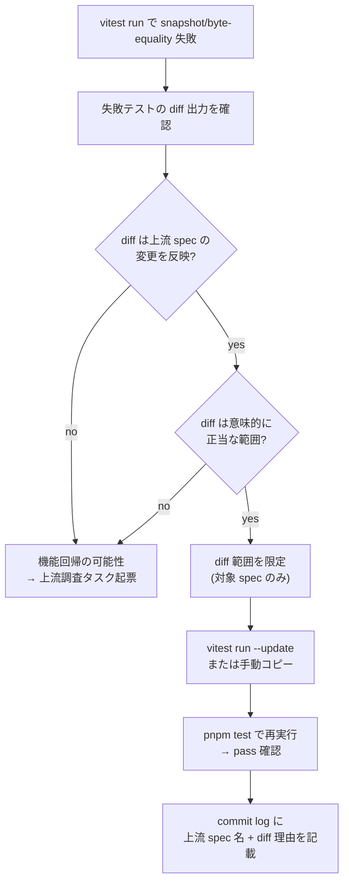

# Build Pipeline Guide

DraftOle のビルドパイプラインを正しく扱うためのガイド。`src/runtime/prelude.ts` 改修時の必須手順、stray `.js` 検出、トラブルシューティングを集約。

## 1. パイプライン全体図

```mermaid
flowchart LR
  PRE["src/runtime/prelude.ts"]
  GEN["src/js/vanilla/internal/<br/>runtime-prelude.gen.ts"]
  DIST["dist/index.cjs<br/>dist/index.js"]
  TRANSF["dist/transformer/index.js"]
  OUT[".out/runs/*/script.js"]
  E2E["Playwright e2e"]

  PRE -->|pnpm build:runtime| GEN
  GEN -->|pnpm build (tsup)| DIST
  PRE -.参照.-> TRANSF
  DIST -->|pnpm build:examples| OUT
  TRANSF -->|require| OUT
  OUT -->|webServer| E2E

  style GEN fill:#fff2c4,stroke:#c08400
```

### 各ステップの役割

| ステップ | 入力 | 出力 | 必要タイミング |
|---|---|---|---|
| `pnpm build:runtime` | `src/runtime/prelude.ts` | `runtime-prelude.gen.ts` | prelude.ts 変更時 |
| `pnpm build` (tsup) | `src/index.ts` + 全 `src/**/*.ts` | `dist/index.{cjs,js}` | gen.ts 更新時 / dist が古いとき |
| `pnpm build:transformer` | `src/transformer/**` | `dist/transformer/index.js` | transformer 変更時 / `pnpm build` で dist が clean されたとき |
| `pnpm build:examples` | examples + `dist/transformer` + `dist/index.cjs` | `.out/runs/*/script.js` | dist 更新時 / 新 demo 追加時 |
| `pnpm test:e2e` | `.out/runs/*` を webServer 経由 | – | e2e 検証時 |

### `pnpm verify` の全段順序（2026-05-10〜）

```
lint → typecheck → test → build:runtime → build → build:transformer → build:examples → test:e2e
```

`build:runtime` を `build`（tsup）の前に置くのは、tsup が `runtime-prelude.gen.ts` を bundle に取り込むため。gen.ts が古いまま tsup が走ると dist/ に古い prelude が埋め込まれ、e2e で derived 値が更新されない等の挙動不整合になる。

## 2. prelude.ts を改修したら

```sh
pnpm build:runtime              # gen.ts 更新
pnpm build                      # dist 再生成（tsup, gen.ts を取り込む）
pnpm build:transformer          # tsup の clean で消えた dist/transformer を復活
pnpm build:examples             # .out/runs/* 再生成
pnpm test:e2e                   # 動作検証
```

または:

```sh
pnpm verify                     # 上記を全自動で順次実行
```

**重要**: `pnpm build` は tsup の `clean: true` 設定で `dist/` 全体をクリーンするため、その後に `pnpm build:transformer` を再実行する必要がある（順序固定）。

## 3. stray `.js` を疑ったら

過去に `pnpm build:runtime` が `rootDir` 違反で失敗した際、`tsc` が `src/` 配下に `.js` を誤って emit した事例がある（最大 77 ファイル）。これらが残っていると `tsup` が `.ts` と `.js` 両方をバンドルして循環参照を生む。

### 検出

```sh
find src -name '*.js' -not -name '*.gen.js'
```

`.gen.js` は intentional な生成物（現状なし、将来用）なので除外。期待結果は **0 件**。

### 一掃

```sh
find src -name '*.js' -not -name '*.gen.js' -delete
```

実行後、再度 `find` で 0 件確認。

### 再発防止（自動）

`.gitignore` に `src/**/*.js` を登録済（2026-05-10〜）。`tsc` が `src/` 配下に `.js` を誤 emit しても **`git status` で表示されず**、誤コミットを物理的に防ぐ。ただし tsup などのバンドラは filesystem を直接 scan するため、`.gitignore` では tsup の巻き込みを完全には防げない。stray が残ったら必ず削除すること。

## 4. 症状別トラブルシューティング

### 症状 A: `Class extends value undefined is not a constructor or null`

```
TypeError: Class extends value undefined is not a constructor or null
    at src/html/errors/html-error.js (.../dist/index.cjs:260:44)
```

**原因**: `src/` 配下に stray `.js` ファイルが残っている → tsup が `.ts` と `.js` 両方を解決対象にして循環初期化バグを生成。

**対応**:
1. `find src -name '*.js' -not -name '*.gen.js'` で検出
2. 一掃
3. `pnpm build` で dist 再生成
4. `node -e "require('./dist/index.cjs')"` でロード可能か検証

### 症状 B: e2e で derived 値が更新されない（mvp-demo5 で `'0 items'` が出ない 等）

**原因**: `src/runtime/prelude.ts` を改修したが `runtime-prelude.gen.ts` が古いまま → dist/ や `.out/runs/*/script.js` に旧 prelude が埋め込まれている。

**対応**:
1. `pnpm build:runtime` で gen.ts を最新化
2. `pnpm build && pnpm build:transformer && pnpm build:examples` で dist と examples 出力を再生成
3. `pnpm test:e2e` 再実行

### 症状 C: `pnpm build:runtime` が rootDir 違反で失敗

```
src/composition-root.ts(20,28): error TS6059: File '...' is not under 'rootDir'
```

**原因**: `src/runtime/` 配下のファイルが外部モジュール（`src/js/`, `src/css/` 等）を import しており、`tsc` がそれを include に巻き込んでいる。

**対応**: `src/runtime/tsconfig.json` の `files` を `["./prelude.ts"]` 単一に限定（2026-05-10〜の現状）。新たに `src/runtime/` に外部依存ファイルが追加された場合、本 docs と spec `build-pipeline-recovery` を再評価する必要あり。

## 5. snapshot / byte-equality 失敗時の対応

`pnpm test` で snapshot / byte-equality / classification 系のテストが fail した時の判定フロー。`src/runtime/prelude.ts` や CSS フォーマッタが変わると生成 script / style が変化し、各 demo の baseline と一致しなくなる。「意味的に正当な差分」を「機能回帰」と取り違えないための手順:



### 判定手順

1. **失敗テストを単体実行して diff を取得**
   ```sh
   pnpm vitest run tests/integration/<failing-test>.test.ts
   ```
   stderr の `- Expected` / `+ Received` ブロックを読む。

2. **上流 spec で説明可能かを判定**
   - `src/runtime/prelude.ts` 関連の追加（例: `isInternalPropagation` / `propagateToParent`）→ `each-item-derived-propagation` spec 由来
   - CSS フォーマッタ差分（`box-sizing: border-box;` の改行 等）→ `each-modifier-css-extraction` / CSS 出力系 spec 由来
   - demo ファイル一覧の変化 → 新規 demo 追加 spec 由来
   - 上記いずれにも該当しない → **機能回帰の可能性、上流調査タスク起票**

3. **diff が意味的に正当な範囲か確認**
   - prelude 追加なら **userJs 部分（`document.querySelector(...).addEventListener(...)` 等）は不変** であること
   - フォーマッタ差分なら CSS ルールの追加・削除・値変更がないこと
   - 違反があれば停止して上流調査

4. **baseline を更新**
   - **vitest .snap 形式**:
     ```sh
     pnpm vitest run tests/examples/<test>.snapshot.test.ts -u
     ```
     `--testPathPattern` で対象を限定し、他 snapshot まで書き換えない
   - **独自 binary baseline**（例: `tests/examples/__snapshots__/mvp-demo1-baseline/`, `mvp-demo-colocated/`）:
     - vitest -u 非対応
     - テストファイル内の build ステップ（`node --experimental-strip-types` で fixture を実行）を mimic し、`exportFromRoot` / `root.export` の出力先を baseline dir に patch して再実行する
     - 例: `.kiro/specs/snapshot-baseline-refresh/` の `Task 2.2` 実装参照

5. **commit log に上流 spec と差分理由を明記**
   ```
   test(<spec>): <test 名> baseline 更新 (上流: <上流 spec>)

   - 上流 spec: each-item-derived-propagation
   - 差分理由: prelude 増分 +1188 bytes 反映
   - 確認: diff が prelude IIFE 部分のみ、userJs 不変
   ```

### 典型的な原因例

| 症状 | 上流 spec | 差分内容 |
|---|---|---|
| script.js snapshot で +1188 bytes 増加 | `each-item-derived-propagation` | `propagateToParent` / `isInternalPropagation` / `entry.parent` チェック追加 |
| style.css snapshot で `box-sizing` の改行が変化 | `each-modifier-css-extraction` 等の CSS 出力系 | CSS フォーマッタの整形ルール変更 |
| `tests/meta/e2e-coverage.test.ts` で「分類されていない demo」エラー | 新規 demo 追加 spec | required / whitelist / todo リスト未更新 |
| meta テストが並列実行時のみ fail | 並列 race（temp file pollution） | 単体実行で pass する。本問題ではない、別の test 隔離 issue |

### `vitest run --update` の注意

- `-u` フラグは指定したテストファイルの全 snapshot を更新する。**他 snapshot を巻き込まないよう必ず `--testPathPattern` または明示的ファイル指定で絞る**
- 更新後 `git diff --stat` で範囲を確認し、想定外のファイルがあれば `git checkout` で revert
- binary baseline（`.snap` ではないファイル）は `-u` で更新されない → 個別の再生成スクリプトが必要

## 6. 修復履歴サマリ

### 2026-05-10: build-pipeline-recovery spec

**経緯**: `each-item-derived-propagation` spec 実装中に host shell e2e が失敗。原因調査で 2 つの相互に絡んだ pre-existing 障害が判明:

1. `pnpm build:runtime` が `src/runtime/runtime-context.ts`（`root-responsibility-separation` で追加）の rootDir 違反で失敗していた → gen.ts が prelude.ts 改修時に手動再生成必須の状態
2. tsc 失敗時に `src/` 配下に 77+ 個の stray `.js` が残置 → tsup の循環参照（`HtmlError extends ModuleError` で undefined）

**修復内容**:
- `src/runtime/tsconfig.json` の `include: ["./**/*.ts"]` → `files: ["./prelude.ts"]`（rootDir 違反解消）
- `.gitignore` に `src/**/*.js` 追加（再発防止）
- `package.json` の `verify` に `build:runtime → build → build:transformer` を統合（gen 古さによる事故防止）
- 本 docs を新設

**関連 commits**: `5c6626f` / `d85d199` / `1b2357c`
**spec**: `.kiro/specs/build-pipeline-recovery/`（local-only / .gitignore 配下）

### 2026-05-10: snapshot-baseline-refresh spec

**経緯**: `build-pipeline-recovery` 完了後の vitest 非回帰確認で、5 件の snapshot / byte-equality baseline staleness が判明。原因は `each-item-derived-propagation` の prelude 増分（+1188 bytes）が生成 script.js のバイト列を変えていたこと。

**修復内容**:
- vitest .snap × 3 を `pnpm vitest run -u` で更新（mvp-demo-final / mvp-demo4 / mvp-demo6）
- 独自 binary baseline × 2 を `node --experimental-strip-types` 経由の再生成スクリプトで更新（mvp-demo1 / mvp-demo-colocated）
- 各 diff が prelude IIFE 部分のみ、userJs 不変、index.html / style.css 不変であることを確認
- 本セクション 5「snapshot / byte-equality 失敗時の対応」を新設

**関連 commits**: `9dfabd9`
**spec**: `.kiro/specs/snapshot-baseline-refresh/`（local-only / .gitignore 配下）
