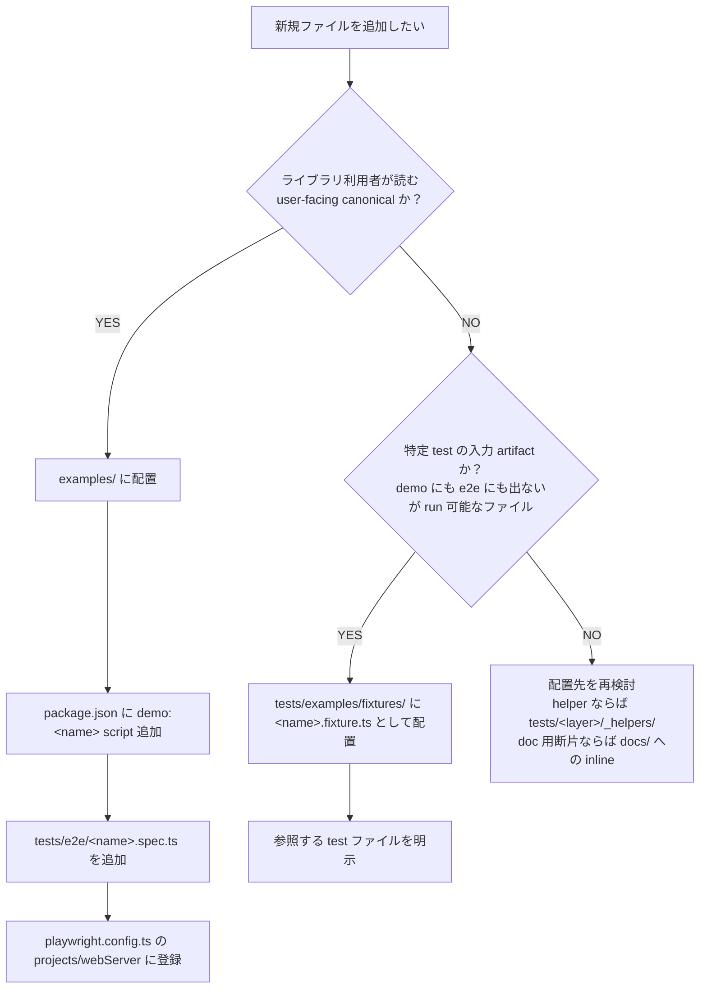

# DraftOle Positioning（対外メッセージの固定点）

> このドキュメントは、現フェーズの DraftOle がどう名乗り、何を主役にし、何をまだ主役にしないかを定義する。  
> README より詳しく、内部設計書ほど実装事情に踏み込まない、**外向きメッセージの固定点** として扱う。  
> 関連 spec: `docs-positioning-spec`、`page-entry-spec`、`page-primitives-spec`、`page-dogfooding-spec`、`page-runtime-separation-spec`。

---

## What DraftOle is now

DraftOle は **静的ページのための View DSL**（a View DSL for static pages）である。

- 入口は `page()`
- 構成要素は `Page` / `Section` / `VStack` / `HStack` / `Text` などの最小 View プリミティブ
- スタイリングは `.padding()` / `.background()` / `.foregroundStyle()` / `.font()` / `.frame()` / `.cornerRadius()` などの View modifier 連鎖
- 出力は素の HTML + scoped CSS。`page()` 経路では `runtime.js` を生成しない

DraftOle はもはや「HTML/CSS/JS を 1 ソースで書ける DSL」一般ではなく、**静的ページを書くための View DSL** として自分を定義する。

スローガン:

> **`static page first`. `page first, App later`.**

---

## Primary use cases（現フェーズの主対象）

`page first` は次のような **静的ページ** を主対象とする。

- ランディングページ（LP）
- ドキュメントページ
- 記事・ブログ・長文レポート
- 静的なダッシュボード / ステータスページ
- マーケティング系の単発ページ

これらは「コンテンツ + 構造 + 装飾」が中心で、サーバー往復やクライアント状態をほぼ持たない。  
DraftOle の `page()` 経路は、この帯域に対して **TypeScript 1 本だけで型安全に書き切れる** ことを価値として提供する。

---

## Current non-goals（今は主役にしないこと）

次は意図的に二次扱いとする。「禁止」ではなく「この spec フェーズの主導線ではない」という意味である。

- **`App` / interactive runtime を主役にすること**  
  jQuery 風スクリプト・埋め込み JS・状態を持つ動的 UI を「DraftOle の代表的な書き味」として打ち出すことは、本フェーズではしない。
- **SPA / SSR フレームワーク的な競合**  
  React / Vue / SvelteKit などの代替を名乗ることは、本フェーズの目的ではない。
- **transformer / runtime 機能を README の最初に出すこと**  
  既存の transformer・jQueryManager・vanilla script ビルダー等は引き続き存在するが、初見導線の主語ではない。
- **`Root` + `html/body/div` の生 HTML DSL を first path に置くこと**  
  これは `page()` 内部実装および互換目的のために残るが、新規ユーザーの入口としては推奨しない。

---

## Why `page first, App later`

順序の理由を明示する。

1. **静的ページの帯域が一番きれいに型で閉じる**  
   View ツリー → HTML/CSS の写像は決定論的で、DSL の型安全性が最も素直に効く。
2. **interactive 部分は別物として後置するほうが API が荒れない**  
   `page` の入口に runtime API を混ぜると、`page` の「静的ページを書ききる」性格が曖昧になる。`page-runtime-separation-spec` で分離は実装済み。
3. **dogfooding がすでに `page` 側で成立している**  
   `examples/page-minimal.ts` / `page-landing.ts` および `.internal/lp/page-lp-builder.ts` で、`page()` のみで LP レベルが書けることが確認済み（`page-dogfooding-spec`）。
4. **App を主役にする前に、static path の体験を固定したい**  
   App / interactive を後段で議題にするとしても、その時点の「DraftOle はこういう DSL です」という土台が `static page first` で固まっている必要がある。

---

## Legacy APIs and compatibility stance

### 1.0.0 以降の最終状態

`1.0.0` で **legacy low-level API を公開面から除去済み**（`legacy-low-level-api-removal` spec 完了）。`import { tag, all, rule, root, createTheme, createStyle, AppContext } from 'draft-ole'` および per-tag shortcuts（`tagA` 〜 `tagWbr` 112 個）の named import は **TS エラー** になる。

ただし **元定義の実装本体は私有実装として継続使用**: kept policy の `css.theme` / `css.class` / `css.media` / `css.keyframes` / `sel.*` namespace がこれら legacy 実装を内部で参照している。完全な物理削除は将来の Phase 2 spec として別途検討。

### 1.0.0 公開面における旧資産の扱い

| 区分 | 扱い |
| --- | --- |
| legacy low-level API named export（`tag` / `all` / `rule` / `root` / `createTheme` / `createStyle` / `AppContext` / per-tag shortcuts） | **公開面から除去済み**（1.0.0）。利用者は `css.theme` / `css.class` / `css.raw` / `sel.*` / `AppDocument` を使うこと。詳細は [`docs/migration/legacy-low-level-api.md`](migration/legacy-low-level-api.md)。 |
| `Root` クラス | **公開面非露出を不変条件として固定**（1.0.0）。`page()` / `app()` の内部実装としては `src/html/elements/root.ts` に存続。物理削除は Phase 2 spec として検討。 |
| `sel` namespace 自体 | **kept**（policy）。`sel.tag` / `sel.all` / `sel.rule` / `sel.root` / `sel.media` / `sel.keyframes` / `sel.tagA` 〜 `sel.tagWbr` は 1.0.0 でも継続提供。 |
| `media` / `keyframes` at-rule | **kept**（policy）。`'draft-ole'` から直接 import 可能。推奨経路は `css.media` / `css.keyframes` / `sel.media` / `sel.keyframes`。 |
| `examples/interactive/mvp-demo.ts` | **interactive / advanced example** として `examples/README.md` の末尾セクションに配置。 |
| `tests/examples/fixtures/mvp-demo0.ts` 〜 `mvp-demo9.ts` ほか MVP 期段階バリエーション | テストフィクスチャ扱い。新規利用の入口でも公開見本でもなく、回帰固定のためにテスト配下に置く。 |
| `examples/interactive/react-demo.tsx` | 外部ランタイム連携の参考例。advanced 扱い。 |
| `transformer` / `jsTemplate` / `createVanillaScript` 等の runtime 系 API | 残置。`page()` 経路の説明には混ぜない。 |

新しいコード・新しいドキュメント・新しい examples は、原則として **`page()` を入口に書く**。  
`app` 経路を出すときは「interactive / advanced」のラベルをつけ、`page` の primary path と競合しないように配置する。

詳細な deprecation policy は [`docs/deprecation-policy.md`](deprecation-policy.md) を、`1.0.0` 移行の具体的なコード書き換え手順は [`docs/migration/legacy-low-level-api.md`](migration/legacy-low-level-api.md) を参照。

### `examples/` と `tests/examples/fixtures/` の役割境界

`examples/` と `tests/examples/fixtures/` は名前が似ているが、対象読者と動作保証レベルが明確に異なる。新規ファイルを追加するときは下記 policy を参照し、誤配置による役割混在を予防すること。

#### 比較表

| 観点 | `examples/` | `tests/examples/fixtures/` |
| --- | --- | --- |
| 誰が見るか | **ライブラリ利用者**（user-facing canonical） | **ライブラリメンテナのみ**（test infrastructure、非 user-facing） |
| demo script (`pnpm demo:*`) 必須 | **必須**（`package.json.scripts` に `demo:<name>` を登録） | 不要（test runner から間接的に消費される） |
| Playwright e2e spec 必須 | **必須**（`tests/e2e/<name>.spec.ts` を 1 本以上配置） | 不要（unit / integration / snapshot test から参照される） |
| 命名規約 | 機能を表す名前（`page-landing.ts` / `showcase-button.ts` / `interactive/priority-tasks.ts` 等） | **`.fixture.ts` suffix を推奨**（例: `mvp-demo-transformed.fixture.ts` / `run-flag.fixture.ts`）。`.ts` のみのファイル名は test infra 起源であることを明示しにくいため極力避ける |
| API 制約 | 1.0.0 公開 API のみ（`app, css, el, hstack, vstack, AppDocument` 等） | 1.0.0 公開 API 推奨。transformer post-output などの専用 fixture は内部 helper を直接参照してよい |
| 削除可否 | 個別の利用者影響を考慮（CHANGELOG に明記） | 対象 test と一体で retire 可能（個別利用者影響なし） |

#### `.fixture.ts` 命名規約

`tests/examples/fixtures/` 配下で **test 専用の入力 artifact** として作成するファイルは `<name>.fixture.ts` suffix を推奨する。これにより `.ts` のみのファイル名と区別され、「user-facing ではない」「test 起源である」ことがファイル名から自明になる。既存の `run-flag.fixture.ts` / `transformer-warning.fixture.ts` / `whitelist-violation.fixture.ts` / `mvp-demo-transformed.fixture.ts` がこの規約の reference 例。

例外として、`tests/examples/fixtures/mvp-demo-helper.ts` のように「振る舞いテスト用の helper module で `.fixture.ts` suffix だと意味が変わる」ものはこの限りではない。判断に迷う場合は `.fixture.ts` を付けて test infra 起源であることを優先表現する。

#### 新規ファイル追加時の判断フローチャート

判断のキーは Q1 と Q2 の 2 段。「demo script と e2e の両方を整備するコストを払う価値があるか」が `examples/` の判定基準、「特定 test の入力として再現性を保ちたいか」が `tests/examples/fixtures/` の判定基準である。

#### `tests/meta/e2e-coverage.test.ts` の分類対応表

`tests/meta/e2e-coverage.test.ts` は demo / fixture を 3 配列（`WHITELIST` / `REQUIRED` / `TODO`）に機械的に分類し、policy 違反を vitest 段階で検出する。本サブセクションの role boundary は下表の通り meta test 配列とリンクする。

| meta test 配列 | 対応する役割 | 含めるファイル種別 | 補足 |
| --- | --- | --- | --- |
| `REQUIRED` | `examples/` 配下の user-facing canonical | `examples/<name>.ts` および `examples/interactive/<name>.ts` のうち、demo script と Playwright project の両方が成立しているもの | `{ demo, project }` mapping を必須。新規 example 追加時は同期更新が必要 |
| `WHITELIST` | demo として実行しない fixture / 構文サンプル | `tests/examples/fixtures/*.fixture.ts`、`mvp-demo-helper.ts` 等の test 専用 helper、demo 化しない構文サンプル | **除外理由を必ず添える**（配列の `reason` フィールド）。理由欄が空のエントリは追加禁止 |
| `TODO` | 将来 retire / promote される過渡的 fixture | 本 spec で retire 予定の `mvp-demo*.ts` 系など、`REQUIRED` でも `WHITELIST` でもない過渡状態のファイル | 本 spec 完了時には空集合になることを目標とする |

policy 文書（本サブセクション）と meta test 配列の drift を防ぐため、`tests/meta/e2e-coverage.test.ts` 冒頭コメントから本サブセクションへ相対 link を張ってある。新規ファイル追加時はまず本フローチャートで配置を決定し、続いて meta test 配列を更新する流れを守ること。

### `examples/` と `tests/examples/fixtures/` の役割境界

`examples/` と `tests/examples/fixtures/` は名前が似ているが、対象読者と動作保証レベルが明確に異なる。新規ファイルを追加するときは下記 policy を参照し、誤配置による役割混在を予防すること。

#### 比較表

| 観点 | `examples/` | `tests/examples/fixtures/` |
| --- | --- | --- |
| 誰が見るか | **ライブラリ利用者**（user-facing canonical） | **ライブラリメンテナのみ**（test infrastructure、非 user-facing） |
| demo script (`pnpm demo:*`) 必須 | **必須**（`package.json.scripts` に `demo:<name>` を登録） | 不要（test runner から間接的に消費される） |
| Playwright e2e spec 必須 | **必須**（`tests/e2e/<name>.spec.ts` を 1 本以上配置） | 不要（unit / integration / snapshot test から参照される） |
| 命名規約 | 機能を表す名前（`page-landing.ts` / `showcase-button.ts` / `interactive/priority-tasks.ts` 等） | **`.fixture.ts` suffix を推奨**（例: `mvp-demo-transformed.fixture.ts` / `run-flag.fixture.ts`）。`.ts` のみのファイル名は test infra 起源であることを明示しにくいため極力避ける |
| API 制約 | 1.0.0 公開 API のみ（`app, css, el, hstack, vstack, AppDocument` 等） | 1.0.0 公開 API 推奨。transformer post-output などの専用 fixture は内部 helper を直接参照してよい |
| 削除可否 | 個別の利用者影響を考慮（CHANGELOG に明記） | 対象 test と一体で retire 可能（個別利用者影響なし） |

#### `.fixture.ts` 命名規約

`tests/examples/fixtures/` 配下で **test 専用の入力 artifact** として作成するファイルは `<name>.fixture.ts` suffix を推奨する。これにより `.ts` のみのファイル名と区別され、「user-facing ではない」「test 起源である」ことがファイル名から自明になる。既存の `run-flag.fixture.ts` / `transformer-warning.fixture.ts` / `whitelist-violation.fixture.ts` / `mvp-demo-transformed.fixture.ts` がこの規約の reference 例。

例外として、`tests/examples/fixtures/mvp-demo-helper.ts` のように「振る舞いテスト用の helper module で `.fixture.ts` suffix だと意味が変わる」ものはこの限りではない。判断に迷う場合は `.fixture.ts` を付けて test infra 起源であることを優先表現する。

#### 新規ファイル追加時の判断フローチャート

判断のキーは Q1 と Q2 の 2 段。「demo script と e2e の両方を整備するコストを払う価値があるか」が `examples/` の判定基準、「特定 test の入力として再現性を保ちたいか」が `tests/examples/fixtures/` の判定基準である。

#### `tests/meta/e2e-coverage.test.ts` の分類対応表

`tests/meta/e2e-coverage.test.ts` は demo / fixture を 3 配列（`WHITELIST` / `REQUIRED` / `TODO`）に機械的に分類し、policy 違反を vitest 段階で検出する。本サブセクションの role boundary は下表の通り meta test 配列とリンクする。

| meta test 配列 | 対応する役割 | 含めるファイル種別 | 補足 |
| --- | --- | --- | --- |
| `REQUIRED` | `examples/` 配下の user-facing canonical | `examples/<name>.ts` および `examples/interactive/<name>.ts` のうち、demo script と Playwright project の両方が成立しているもの | `{ demo, project }` mapping を必須。新規 example 追加時は同期更新が必要 |
| `WHITELIST` | demo として実行しない fixture / 構文サンプル | `tests/examples/fixtures/*.fixture.ts`、`mvp-demo-helper.ts` 等の test 専用 helper、demo 化しない構文サンプル | **除外理由を必ず添える**（配列の `reason` フィールド）。理由欄が空のエントリは追加禁止 |
| `TODO` | 将来 retire / promote される過渡的 fixture | 本 spec で retire 予定の `mvp-demo*.ts` 系など、`REQUIRED` でも `WHITELIST` でもない過渡状態のファイル | 本 spec 完了時には空集合になることを目標とする |

policy 文書（本サブセクション）と meta test 配列の drift を防ぐため、`tests/meta/e2e-coverage.test.ts` 冒頭コメントから本サブセクションへ相対 link を張ってある。新規ファイル追加時はまず本フローチャートで配置を決定し、続いて meta test 配列を更新する流れを守ること。

---

## このドキュメントの使い方

- README（英日）はこのドキュメントの主張を **短く前面に出す**
- `examples/README.md` はこのドキュメントの順序（page-minimal → page-landing → showcase → interactive/advanced）に従う
- 内部進捗を示す `.internal/ai_Docs/done.md` の P1 完了エントリは、このドキュメントを **対外メッセージの固定点** として参照する
- 今後の spec は、このドキュメントに反する主張（例: README 冒頭で App を主役に出す、`Root` を first path に戻す等）をしないこと。方針を変えるときは本ドキュメントを先に更新する
